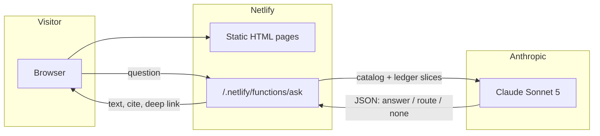
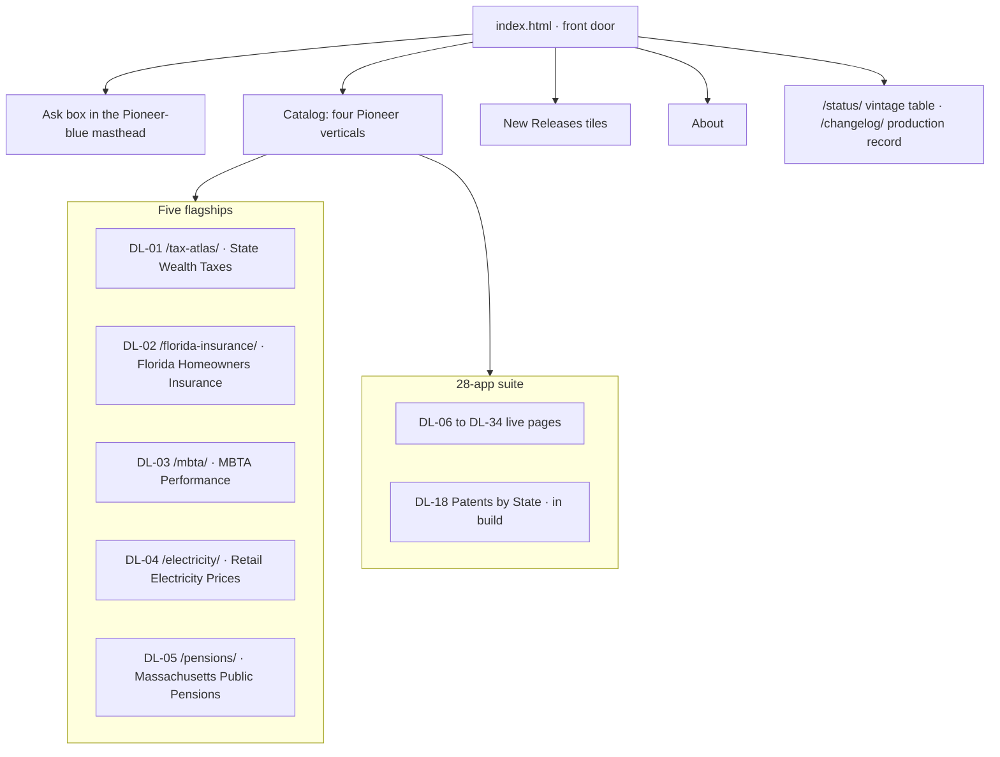
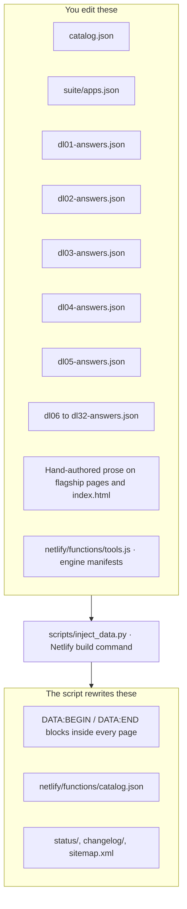
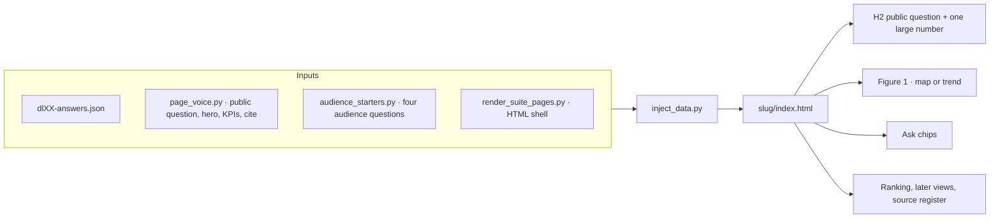
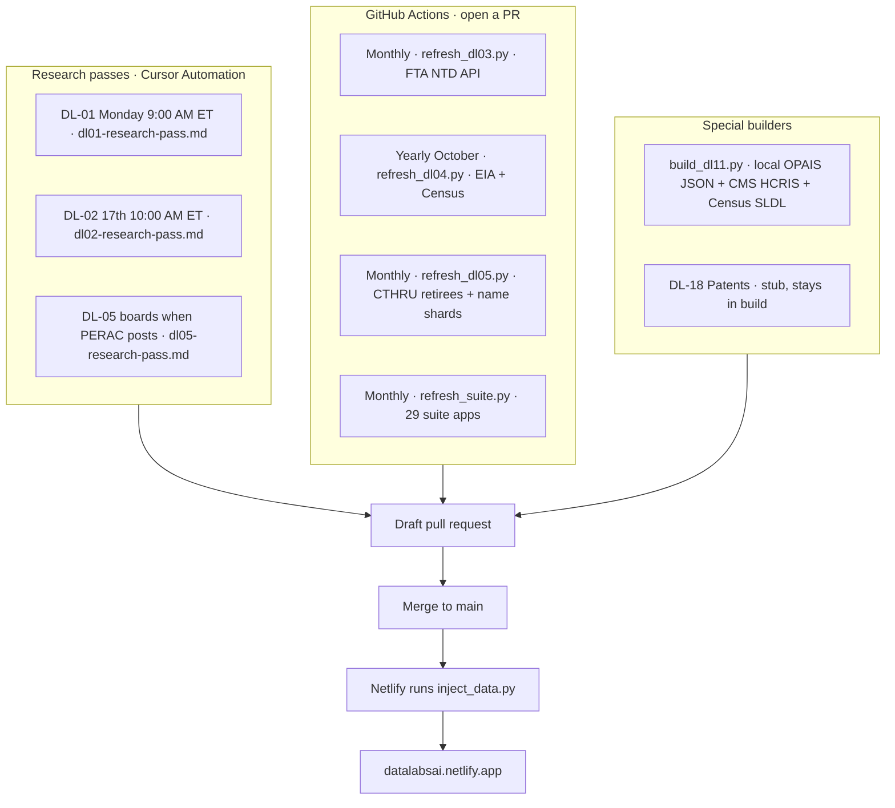
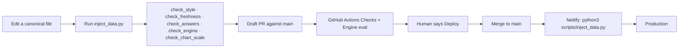
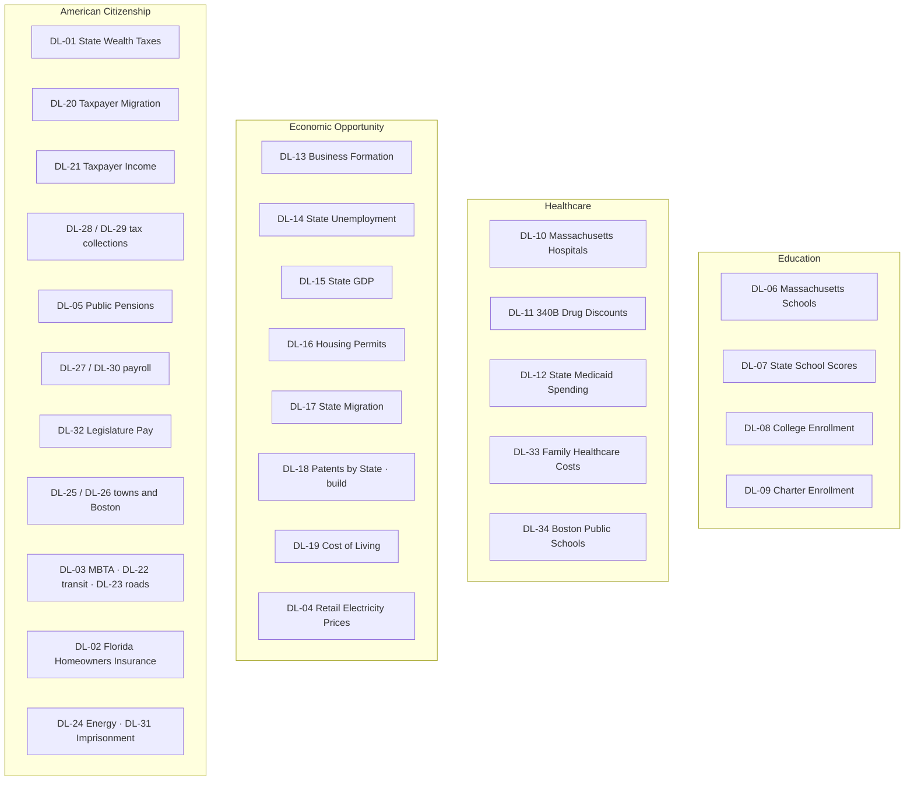

# How Pioneer DataLabs is built

A briefing you can walk through. Live site: [datalabsai.netlify.app](https://datalabsai.netlify.app).
This file is the map. `SETUP.md` is first-time GitHub and Netlify. `AGENTS.md` is the
agent rules. `NEW-TOOL-CHECKLIST.md` is how to add a tool.

## 1. What it is

One static site plus one serverless question engine. Thirty-two numbered tools
(DL-01 through DL-34): five hand-built flagships and a 29-app suite that replaced
the old Tableau workbooks. Every published figure lives in a JSON ledger and
cites a primary source. The model does not invent numbers.



Merging a pull request to `main` is what publishes. Netlify rebuilds the site
by running `python3 scripts/inject_data.py`, then serves the HTML and the
function.

## 2. What a visitor sees



The four catalog verticals are Education, Healthcare, Economic Opportunity, and
American Citizenship. They sit on the first screen under Ask, with application
counts. One topic stays open: Education, or the last one you opened. New
releases sit after the catalog. Each catalog row is a tool: name, coverage
line, place, and data vintage.

A live fifty-state tool opens on one public question, one large number, and a
matching Figure 1 (usually the 50-state map). A Place control rewrites that
same trio for a state. The page does not invent a U.S. total when the file has
no national cell.

## 3. The one rule: edit canonical files only

The repo is a compile. You edit the sources. A build script writes every copy
the pages and the engine read. Hand-editing a generated block is how the site
drifts.



A ledger is the source of truth for figures. Typical fields:

- `tool_id`, `as_of`, `scope`, `exclusions`, `vintage_note`
- `source_id_map` with ids such as `SRC-613-01`
- series as labeled objects, not bare tuples
- `derived`: precomputed ranks, windows, U.S. and MA snapshots. The model is
  told to prefer these over its own arithmetic
- `derived.secondary`: later views (other published series on the same page)

`page.revised` on Florida is the public Revised date. Any Florida ledger or
page edit must set that field to today and run inject.

## 4. How a page is compiled



Flagships (DL-01 to DL-05) are hand-authored pages. Inject fills charts,
headlines, and keyed blocks from the ledger. Remaining narrative (methodology,
source register prose) stays in the HTML and is sentinel-checked so it cannot
silently drift from the ledger.

Suite pages (DL-06 to DL-34) are generated shells. `render_suite_pages.py`
writes the HTML. Inject then drops in the ledger payload, the national-lens
answers, takeaways, and cite line. Shared look lives in `assets/datalabs.css`,
`assets/suite.css`, and vendored Chart.js at `assets/chart.umd.min.js`.

The engine never draws the chart. It returns a chart or view id. The page
already has that graphic and a `#view-...` deep link.

## 5. How a question is answered

There is no router. A two-stage handoff (pick a tool, then read its ledger)
failed eval: it declined questions the ledgers already cover. One Sonnet 5
call sees the catalog plus ledger slices and returns structured JSON.

```mermaid
sequenceDiagram
  participant Box as Ask box
  participant Fn as ask.js
  participant Man as tools.js
  participant Led as Ledger JSON
  participant Claude as Sonnet 5
  Box->>Fn: POST question + last 2 exchanges
  Fn->>Man: match triggers on the question
  Man->>Led: every tool ships coreSlice
  Man->>Led: trigger hits also ship modelSlice
  Fn->>Claude: rules + catalog + cores + full hits
  Claude-->>Fn: decision answer / route / none
  Fn->>Fn: validate tool, chart, view, highlight
  Fn-->>Box: text, detail, cite, link
  Box->>Box: open the tool page at the deep link
```

`tools.js` is the per-tool manifest. Adding an AI-enabled tool is one ledger
JSON plus one entry here. `ask.js` iterates the list and does not take
per-tool edits.

- **coreSlice**: sent when the place or topic matches, and on every
  trigger hit. Scope, latest, slim `derived`. Small on purpose. A
  question with no signal still ships every core, so a thin trigger
  list cannot hide a tool. Flagships do not ride along on every question.
- **modelSlice**: full answering subset when a trigger phrase hits (for
  example "taxpayer returns" or "state tax").
- **decision**: `answer` (cite this ledger), `route` (send them to another
  catalog tool), or `none` (DataLabs does not cover it).
- **thinking**: off on a single trigger hit. On when there is no hit or
  more than one. The answer returns before the question log write.
- The Anthropic key lives only in Netlify as `ANTHROPIC_API_KEY`. It is never
  in the repo. `?ai=0` hides the box.

Offline check: `node scripts/check_engine.mjs` (trigger recall and payload
shape, no key). Live check: `scripts/eval_engine.mjs` hits the production
ask endpoint with golden questions.

## 6. How data gets into the repo

Nothing on the public page is fetched live at request time except the ask
function. Ledgers are refreshed on a cadence, as pull requests, then merged.



| Tool | Page | Ledger | Refresh |
| --- | --- | --- | --- |
| DL-01 State Wealth Taxes | `/tax-atlas/` | `dl01-answers.json` | Weekly research pass. Editorial sources. |
| DL-02 Florida Homeowners Insurance | `/florida-insurance/` | `dl02-answers.json` | Monthly research pass. |
| DL-03 MBTA Performance | `/mbta/` | `dl03-answers.json` | Monthly Action from the FTA NTD API. |
| DL-04 Retail Electricity Prices | `/electricity/` | `dl04-answers.json` | Yearly Action, October, EIA and Census. |
| DL-05 Public Pensions | `/pensions/` | `dl05-answers.json` | Monthly CTHRU retirees and `pensions/search/` shards. Boards when PERAC posts. |
| DL-06 to DL-34 | slugs in `suite/apps.json` | `dlXX-answers.json` | Monthly Action. Live builders fetch public files. 340B rebuilds from a local OPAIS export. Family Healthcare Costs rebuilds from the CHIA MHIS Excel. Patents stays a stub. |

Do not invent a second refresh next to these jobs. Do not mark a stub `live`
or invent figures. The five flagships stay frozen during a suite refresh.

## 7. How a change goes live



Cloud agents open draft PRs. They do not merge and they do not push `main`
unless you say Deploy.

CI on every PR (`checks.yml`):

- House style (no em dashes) and Florida / electricity / pensions sentinels
- Ledger freshness versus publisher cadence
- Inject is a no-op (generated blocks already committed)
- Public question matches the hero number (`check_answers.py`)
- Engine goldens and payload shape
- Chart zero-baseline rules

A second workflow (`eval.yml`) asks the live production engine the golden
questions. The key stays in Netlify.

## 8. The catalog, in one picture



Exact titles, slugs, and sources are in `catalog.json` and `suite/apps.json`.
The catalog on the front door is generated from `catalog.json`.

## 9. What the platform will not do

- Invent a figure, a U.S. average, or a Near-Term Risk rating change
- Answer outside a tool's `scope` / `exclusions` (advice, predictions, unpublished cells)
- Mix workstreams: Florida standalone export stays on its own closed branch
- Fetch publisher files in the browser. Pages read the compiled ledger
- Put the Anthropic key in git

Reliability comes from `derived` in the ledger, goldens in `check_engine.mjs`,
and the freshness gate. If a publisher file is annual with a lag, an older
vintage on the catalog row is correct, not stale.

## 10. Talking track

1. **It is a compile, not a CMS.** JSON ledgers in, HTML and an ask payload out.
2. **One site, two layers.** Static pages anyone can cite. One function that
   may only speak from those pages' ledgers.
3. **One model call.** Payload slimming scales the catalog. A router does not.
4. **Refresh is a PR.** Humans and Actions update ledgers. Merge publishes.
5. **Pioneer chrome, public sources.** Header blue `#293C5C`, gold `#CCB26D`.
   Every number has a `SRC-` id a reader can follow.

To add a tool, follow `NEW-TOOL-CHECKLIST.md`: scope and exclusions first,
then the ledger, then the page, then one `tools.js` entry and goldens.
The data verification is the real work.
